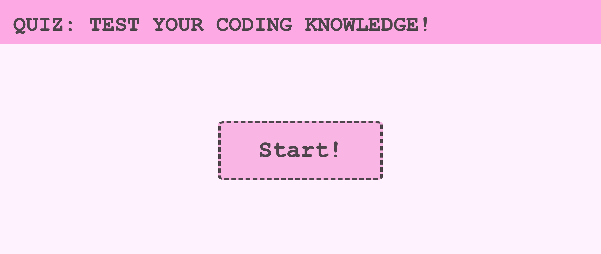
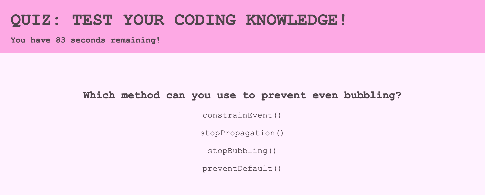
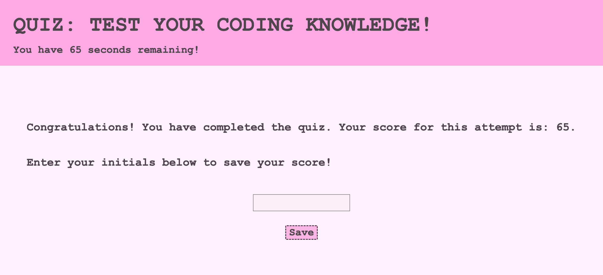
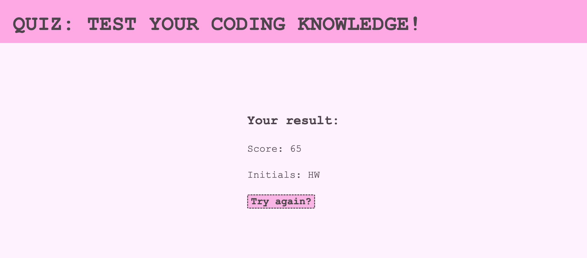
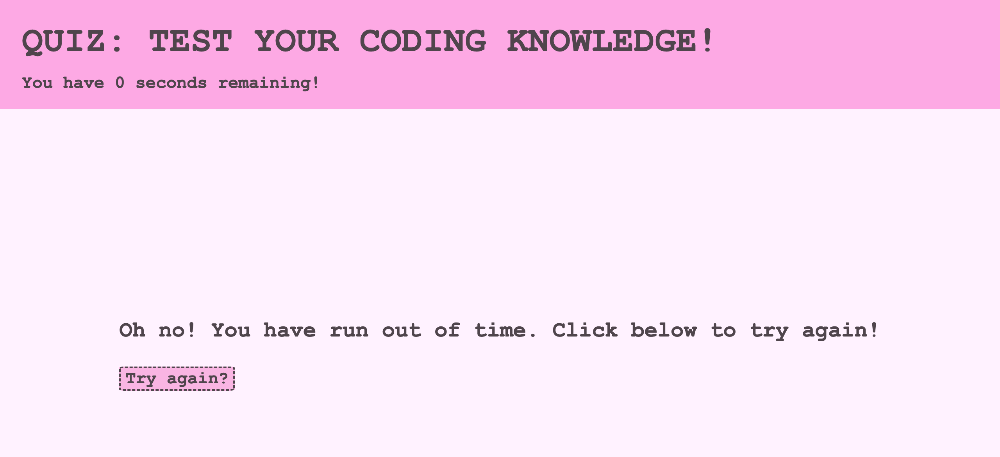

# 04-Quiz

## Project Description
<a href="https://hanwol525.github.io/04-Quiz/">Deployed page</a>

This is a 10-question, timed quiz on JavaScript and DOM fundamentals. Users will receive a final score based on their time remaining (-/100 seconds); wrong answers will deduct 10 seconds. Users can input their initials, which are locally stored and displayed along with the final score.

## Technology Used
<ul>
<li>HTML - provides structure and basic content for the site
<li>CSS - provides style for the page
<li>JavaScript - for HTML generation and quiz interactivity
<ul>

## Overview of Site

## Summary
<ul>
<li>Used HTML to set div structure
<li>Used CSS to add style to the page
<li>Used JavaScript to generate HTML elements and add interactivity
</ul>

## Links
Github: <a href="https://github.com/hanwol525">hanwol525</a>
